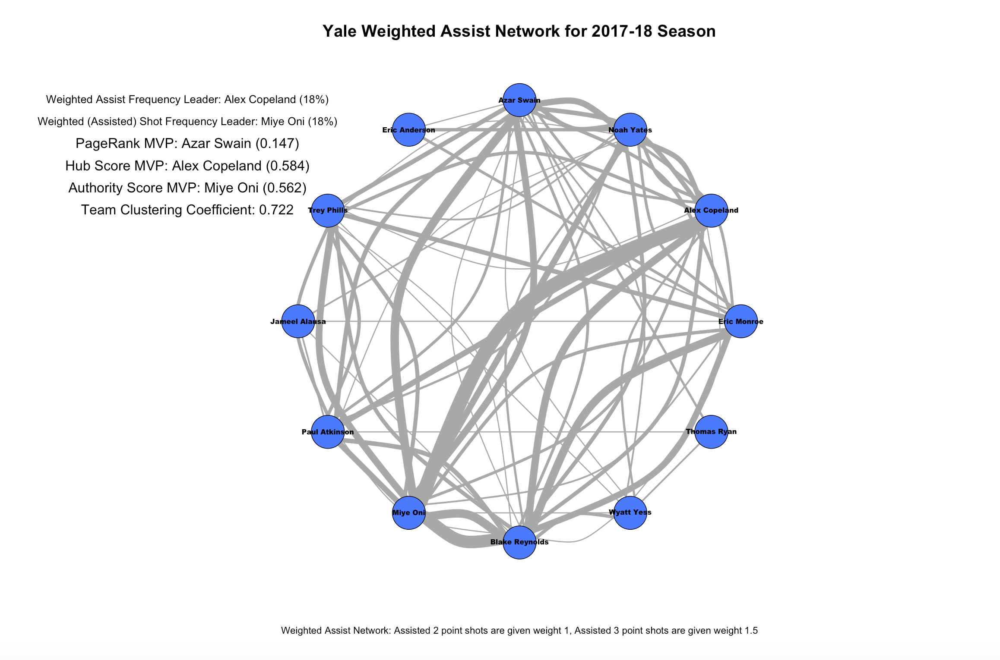
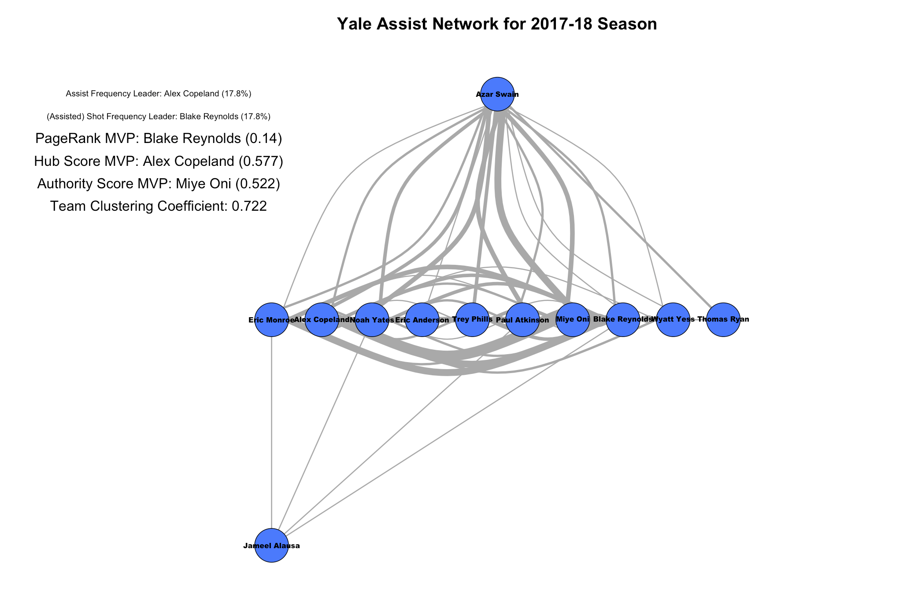
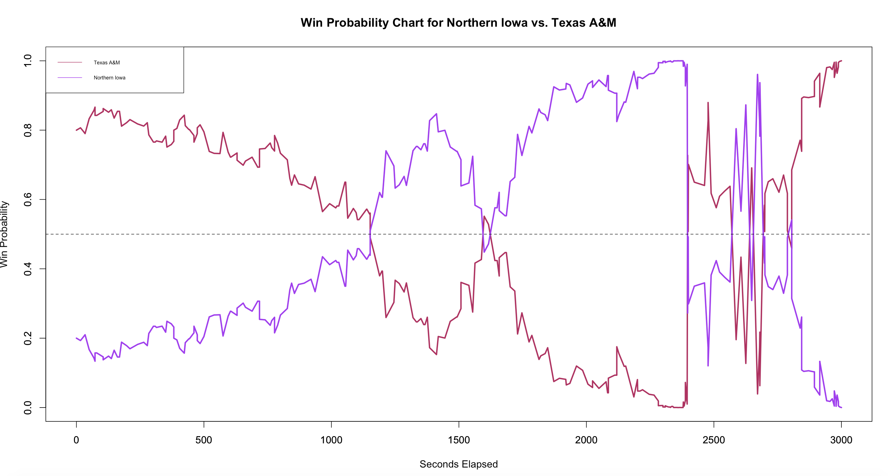

# NCAA_Hoops_Play_By_Play
Men's College Basketball Play by Play Data

__NCAA_Hoops_PBP_Scraper.R:__ An R file used to scrape data from ESPN. To get a particular team's play by play data, call ```get_pbp(team)```. Use the ```get_pbp_game(gameIDS)``` to get play-by-play data for a specific vector of ESPN game ids. To get a particular team's roster, call ```get_roster(team)```. Note that team names must adhere to ESPN naming conventions. A full dictionary of team names used by ESPN is provided in __ids.csv__  Note that play by play data is not available for all games.

__pbp_2016_17/:__ A folder containing play by play csv files for each team for the 2016-17 season. Additionally, the file [all_games.csv](https://drive.google.com/open?id=0BzSws2ZDOraxbXF0aWNJNmxCdnM) (too large for GitHub) contains all games scraped for the 2016-17 season. Each team's .csv file contains the following variables:
   * __play_id__: The index of a play in a given game
   * __half:__ Overtimes denoted by 3, 4, etc.
   * __time_remaining_half:__ Time left in a given period of play, as it would appear on a scoreboard.
   * __secs_remaining:__ The number of seconds left in a given game.
   * __description:__ A description of what happened on the given play.
   * __home_score/away_score:__ Scores for the home and away teams, as denoted by ESPN. Even for neutral site games, a "home team" is denoted by choosing the team listed second in ESPN box scores.
   * __away/home:__ Home and Away teams. See above for treatment of neutral site games.
   * __home_favored_by:__ Number of points the home team is favored by, if available. (i.e. 6 corresponds with traditional Vegas line of -6.0)
   
__Assist_Network.R:__ The function ```assist_net(team, node_col, season, rmv_bench)```, used to create college basketball assist networks. 
  * ```team``` is the ESPN team name
  * ```node_col``` is the node color for the graph
  * ```season```: Options include "2016-17", "2017-18", or a vector of ESPN game IDs. 
  * ```rmv_bench```: Logical. If TRUE, removes all players who aren't in the network. 
  * ```tree```: Logical. If TRUE, draws graph in tree structure. If FALSE, draws graph in circle
  * ```three_weights```: Logical. If TRUE, assisted three point shots are given 1.5 weight. If FALSE, assisted three point shots are given weight 1. In both cases, assisted 2 point shots are given weight 1. 
  
__rosters_2016_17/:__ 2016-17 rosters for each team.

__rosters_2017_18/:__ 2017-18 rosters for each team.

__wp_model.R:/__ Prepares data and builds win probability model (saved as object __wp_hoops.rds__). Requires [all_games.csv](https://drive.google.com/open?id=0BzSws2ZDOraxbXF0aWNJNmxCdnM).

__wp_charts.R:/__ Plots win probability chart for given game. Usage:```wp_chart(ESPN_Game_ID, home_color, away_color)```.

# Examples
### Assist Networks
* Weighted Assist Network

```assist_net("Yale", "royalblue1", "2017-18", rmv_bench = T, tree = F, three_weights = T```

* Tree Assist Network

```assist_net("Yale", "royalblue1", "2017-18", rmv_bench = T, tree = T, three_weights = F```

### Win Probability Charts
* Texas A&M vs. Northern Iowa, March 20, 2016

```wp_chart(400872229, "maroon", "purple")```
